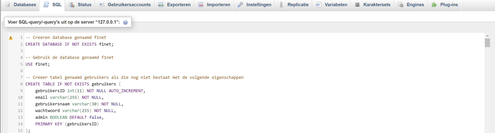

## F1NET CRUD Applicatie

Gemaakt door: Ruben Stap, Thijn Huisman, Bram Knaapen.

## Inleiding

op onze site kan je informatie vinden over alles wat met formule 1 te maken heeft. je kan dingen vinden over coureurs, teams banen en je kan elke race terug zien. ook hebben we op de hooftpagina  het meest recente nieuws staan (not). als je inlogt kan je bij een artikel op het hartje drukken en toevoegen aan je favoriet zodat je ze makkelijk kan terug vinden.

### Install methodes

**Uitleg Windows :**
XAMPP
Download en installeer de laatste versie van [XAMPP](https://www.apachefriends.org/download.html) voor jouw operating system.
Start de Apache module in het XAMPP controlcenter.

Ga in xampp naar het mapje explore zie afbeelding.
Open het mapje htdocs en plaats hier de map met de website er in
` `
``

Ga in je browser naar http://localhost/ en kies voor het aangeleverde bestand.
Welkom op de website.

MySql:
Stap 1: Start Apache & phpmyAdmin op. Druk daarna zoals aangegeven op de "Admin" knop.
` `
``

Stap 2: Je moet nu op de phpmyAdmin startpagina. Zie afbeelding.
` `
``

Stap 3: Klik daarna op de SQL knop in de navbar.aan
` `
``

Stap 4: Pak de query van "export.sql" en kopieer deze.
Stap 5: Plak daarna deze query in het lege veld. Zie afbeelding

 

Stap 6: Klik nu op f1net database links van de pagina. Zie afbeelding
` `
``

Stap 7: Nu heb je een overzicht van de tabellen in de database. Zie afbeelding
` `
``

Hoe kom ik in de website:
Stap 1: Ga naar je path waar je project is in opgeslagen.aan
` `
``

Stap 2: Klik rechter muisknop op je projectmapje en klik op "Open in terminal"
` `
``

Stap 3: Voer dit commando uit "php -S localhost:8000" in je terminal.
` `
``

Stap 4: Kopieer vervolgens deze link en plak deze in je browser of houd cntrl ingedrukt en klik linkermuisknop. Hierdoor ga je meteen naar de link.

Stap 5: Nu zit je op de website.
` `
``

**inloggen standaart admin**

het gebruikers naam van de standaart admin is: admin
het email is : admin@admin
het wachtwoord is: admin
